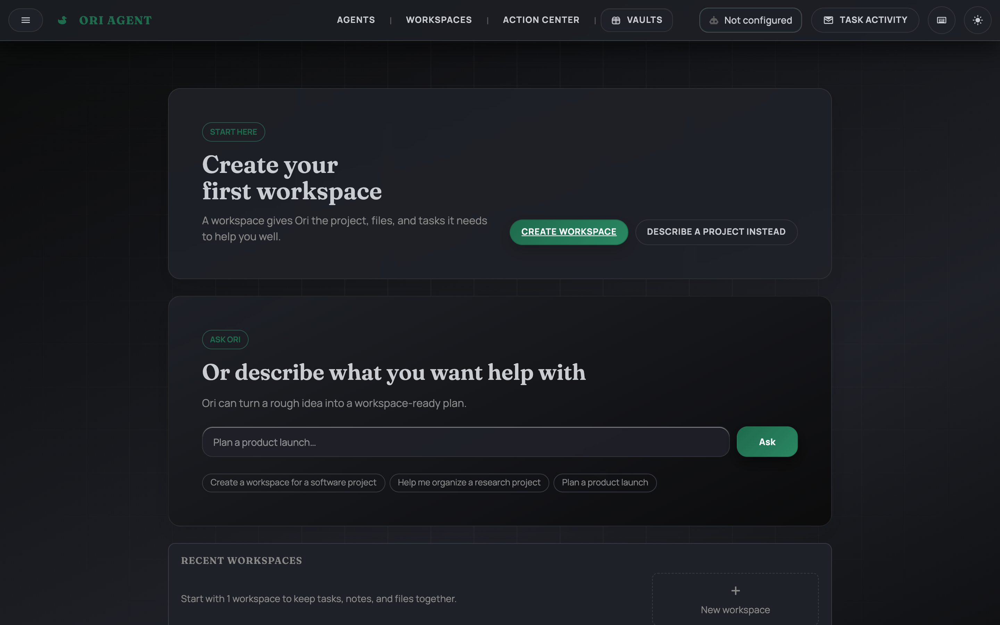
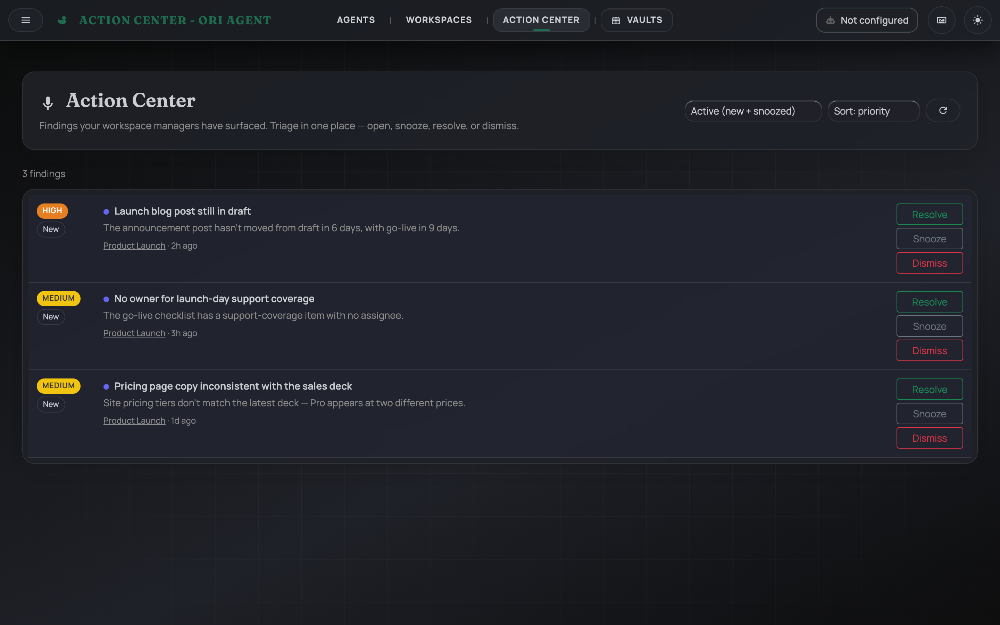
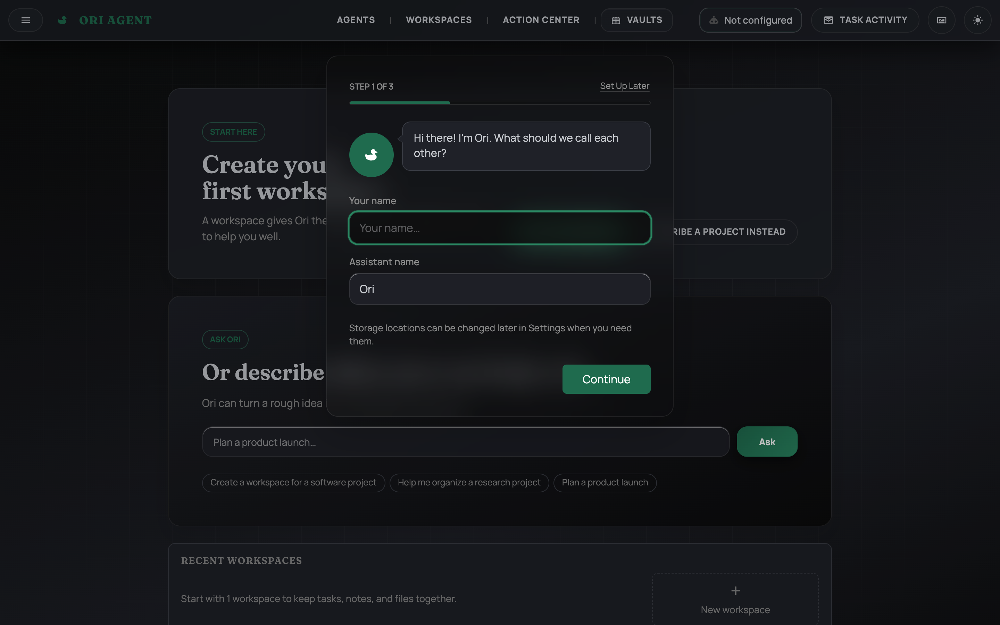
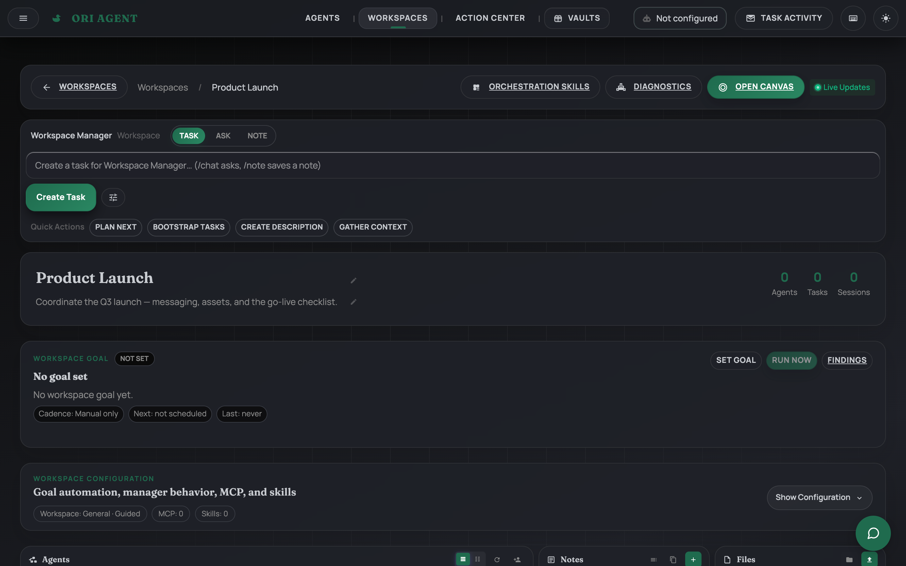

#  Ori Agent

> **Give your agents a mission. They work on a schedule. You triage the findings.**

Autonomous AI workspaces — guardrailed by policy, running **local-first** on your machine.


<p align="center">
  
</p>

**Ori Agent** is a local-first platform for **autonomous AI agents**. Give a **workspace** a mission and it works on a recurring schedule under an **autonomy policy** you set — surfacing what it finds as **opportunities** you triage from a single cross-workspace **Action Center**. Compose each workspace from multiple named agents, each with its own model, prompt, skills, and MCP tools. Everything stays on your machine unless you opt into cloud LLMs.

## ⚙️ How it works

1. **Compose a workspace** — group one or more agents around shared notes, files, and tasks, and bind the MCP servers and Skills they're allowed to use.
2. **Set a mission + autonomy policy** — describe what the workspace should pursue, and choose how much it's allowed to do on its own.
3. **It runs on a schedule** — the mission executes on a cron-like cadence without you kicking off each run.
4. **Triage in the Action Center** — findings collect in one inbox where you **open**, **snooze**, **resolve**, or **dismiss** them. A resolved issue that a later run re-detects re-surfaces automatically, so nothing gets silently buried.

### Autonomy policies

A mission's reach is bounded by the policy you choose for the workspace:

| Policy | What it can do |
|--------|----------------|
| **Watch** | Read-only tools. No writes anywhere. |
| **Propose** | Reads plus workspace-internal writes (draft notes/artifacts, recommended-task drafts). External-effect tools stay denied. |

Each MCP/skill binding is classified by side effect (read / write / external), and the autonomy gate enforces the policy **per tool call** — so a mission can't take an action you haven't authorized for that workspace.

## ✨ What you can do

- **Missions & Action Center** — let a workspace work autonomously on a recurring cadence under an autonomy policy, and triage its findings (“opportunities”) from one cross-workspace inbox.
- **Workspaces** — group agents to collaborate, with shared notes, files, and tasks scoped to the workspace. The same agent can have different tool access in different workspaces.
- **Tasks & scheduling** — assign tasks to agents and run them on a cron-like schedule, with structured result storage (CSV/JSON output specs).
- **Multiple agents** — create named agents, each with its own provider/model, system prompt, skills, and MCP servers.
- **Multi-agent orchestration** — chain agents into workflows and combine their results.
- **MCP servers & Skills** — extend agents with external tools (MCP) and reusable prompt-based capabilities (Skills), bound per workspace.
- **Sessions** — persistent, searchable chat history with folders and tagging.
- **Private Vault** — local encrypted storage for secrets and sensitive records, backed by the OS keychain.
- **Usage & cost tracking** — monitor token usage and spend across providers.
- **Runs anywhere** — browser UI, HTTP API, or the macOS menu bar app.

## 📸 Screenshots

<p align="center">
  
</p>

| Onboarding | Workspace |
| :---: | :---: |
|  |  |

## 🚀 Quick start

### macOS (recommended)

1. Download the DMG from the [latest release](https://github.com/johnjallday/ori-agent/releases/latest).
2. Open it and drag **OriAgent.app** to Applications. Ori runs as a **menu bar app** that starts/stops the server and can auto-start on login.
3. Open the interface at **http://localhost:8765** and add an API key in Settings (or run a local provider — no key needed).

> First launch may show a Gatekeeper warning (normal for un-notarized open-source apps). Right-click the app → **Open**, or see [macOS install notes](docs/INSTALLATION_MACOS.md).

### Build from source

```bash
git clone https://github.com/johnjallday/ori-agent.git
cd ori-agent
go mod tidy

# Pick a provider: set a cloud key…
export OPENAI_API_KEY="your-api-key"      # or ANTHROPIC_API_KEY / GEMINI_API_KEY
# …or run a local model (Ollama, LM Studio, MLX) — no key required.

./scripts/build-server.sh && ./bin/ori-agent
```

Then open **http://localhost:8765**.

**Other platforms:** [Linux (.deb / .rpm)](docs/INSTALLATION_LINUX.md) · [Windows](docs/INSTALLATION_WINDOWS.md)

## 🤖 Providers

Run fully local, or bring your own cloud key — Ori abstracts the provider so you can switch freely.

| Type | Provider | Configure with |
|------|----------|----------------|
| Cloud | OpenAI | `OPENAI_API_KEY` |
| Cloud | Anthropic Claude | `ANTHROPIC_API_KEY` |
| Cloud | Google Gemini | `GEMINI_API_KEY` |
| Local | Ollama | `OLLAMA_BASE_URL` (default `http://localhost:11434`) |
| Local | LM Studio | `LM_STUDIO_BASE_URL` (default `http://localhost:1234/v1`) |
| Local | MLX LM (Apple Silicon) | `MLX_LM_BASE_URL` (default `http://localhost:8080/v1`) |
| CLI | Codex · Claude Code | Auto-detected from an existing CLI login — no extra key |

## 📚 Documentation

- **Install:** [macOS](docs/INSTALLATION_MACOS.md) · [Linux](docs/INSTALLATION_LINUX.md) · [Windows](docs/INSTALLATION_WINDOWS.md)
- **API reference:** [docs/api/API_REFERENCE.md](docs/api/API_REFERENCE.md)
- **LLM provider guide:** [internal/llm/README.md](internal/llm/README.md)
- **Full docs index:** [docs/README.md](docs/README.md)

## 🧩 Extending Ori

Ori gets its tools from **MCP servers** (external tool processes) and **Skills** (reusable prompt-based capabilities), both bound per workspace so the same agent can have different access in different contexts. Skills are directories containing a `SKILL.md` with `name`/`description` frontmatter and a prompt body, compatible with the Claude/OpenAI skill format. See the [docs index](docs/README.md) for details.

## Open-Core Boundary

Ori Agent core is open-source and can be used commercially. Web3/token and marketplace payment services are not included in this repo and are operated privately.

Open-source core includes:
- Agent runtime, orchestration, MCP integration, and skills system
- UI, settings, and workspace management
- Web3 wallet UI for local metadata only (no on-chain operations)

Private services (not included):
- Ori Token issuance, daily credits, cashout, and anti-cheat
- Marketplace payments and Ori-specific monetization flows

Details: `docs/architecture/open-core-boundaries.md`

Additional terms:
- `ORI_SERVICES.md` (private services access)
- `TRADEMARKS.md` (branding and trademark use)

## 📄 License

MIT — see [LICENSE](LICENSE).

## 💬 Support

- 🐛 [Issues](https://github.com/johnjallday/ori-agent/issues) · 💡 Feature requests: open an issue with the `enhancement` label · 💬 [Discussions](https://github.com/johnjallday/ori-agent/discussions)
- This app is functional but moving fast — expect breaking changes, and feedback is welcome.
- ☕ Support development: [buymeacoffee.com/johnjallday](https://buymeacoffee.com/johnjallday)

---

Made with Go and modern web technologies.
