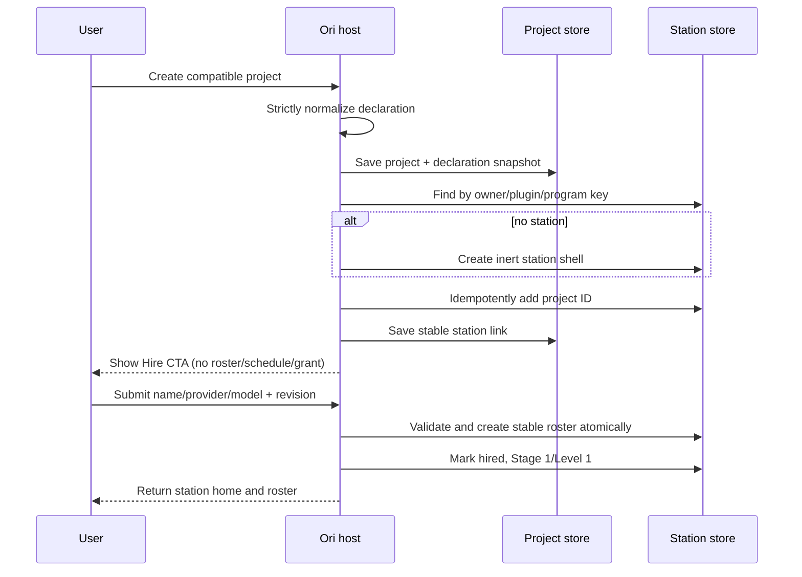
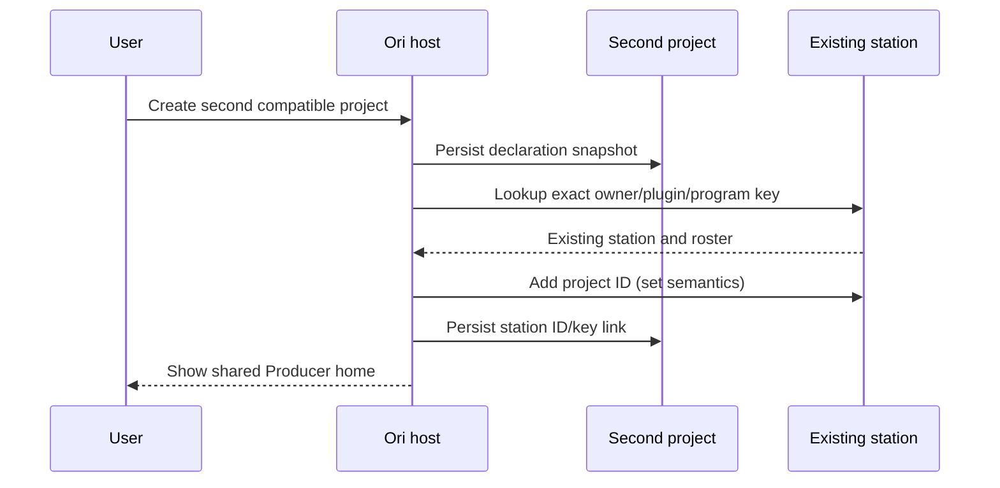
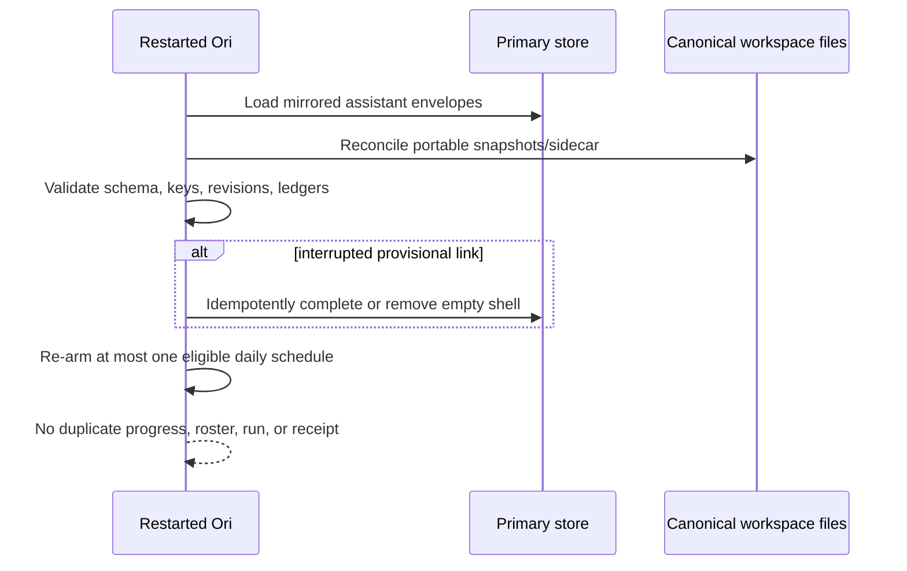
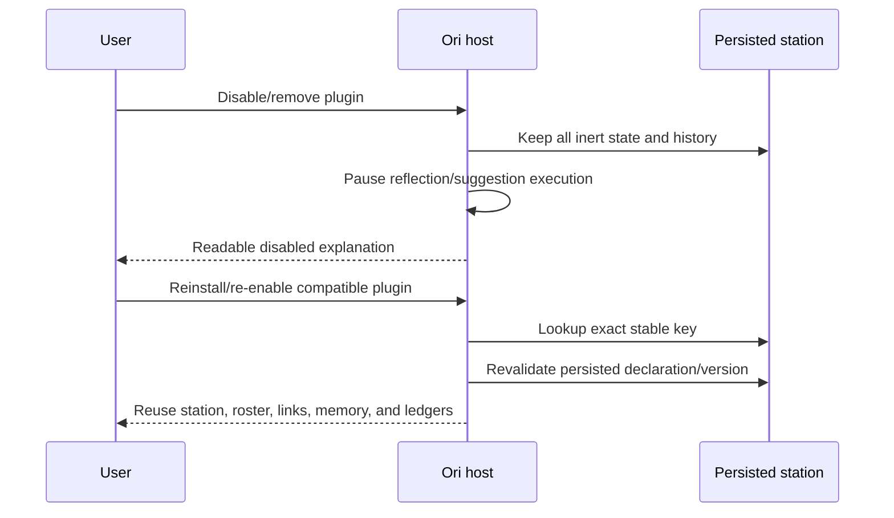

# Assistant Program Contract v1 and v2

Status: v1 accepted and shipped; scoped v2/domain-Home amendment accepted for specialist-setup implementation

## Purpose and boundaries

Assistant programs are a generic, trusted-blueprint contract for one durable
assistant station shared by a bounded set of project workspaces. The contract
contains inert data only. It cannot declare HTML, URLs, filesystem paths,
commands, code, MCP servers, runtime grants, confirmation policy, or executable
hooks.

A program has two distinct persistence surfaces:

1. Every compatible project snapshots the normalized declaration in its
   `TemplateProvenance` and stores an immutable project link.
2. One dedicated station workspace owns hire state, the stable roster, persona
   progress, reflection state, managed learnings, and idempotency ledgers.

The station key is `(owner_user_id, plugin_id, program_id)`. Display names,
folder slugs, template names, tags, project filenames, and plugin availability
are never identity inputs.

The feature is domain-blind in Ori. Labels, role prompts, stage names, hire copy,
reflection rubric, and recommendation wording come from the trusted declaration.

## Versioned declaration

`template.json` may contain one optional `assistant_program` object. Version 1
is decoded as an isolated raw JSON block with unknown fields rejected. The
whole block is either normalized or unusable; no subset is applied.

The v1 block contains:

- `schema_version`, `id`, station display copy, and default primary-role name;
- exactly one primary role and a bounded list of specialist roles, each with a
  stable ID, label, description, prompt, and trusted skill names;
- ordered persona stages and monotonic accepted-completion thresholds;
- bounded reflection settings: minimum linked projects, daily cadence, maximum
  projects/events/candidates/evidence, and rubric text;
- hire, progress, disabled-state, and promotion display text.

Limits are enforced before workspace creation: 8 roles, 8 stages, 8 KiB per
prompt/rubric, 64 candidates, 16 evidence references per candidate, 32 linked
projects per reflection, 128 events per project, and no schedule more frequent
than daily. Stable IDs are lowercase ASCII identifiers of at most 64 bytes.
Exactly one role is primary; role and stage IDs are unique; the first stage
starts at zero; later stage thresholds increase strictly; every referenced
primary role and stage must exist.

An absent block is a no-op. Unsupported versions, unknown fields, oversized
text/collections, invalid references, and malformed bounds set an actionable
`assistant_program_error` and block creation for trusted plugin blueprints.
Ordinary and older blueprints remain unchanged.

## Durable records

### Declaration snapshot

`TemplateProvenance.AssistantProgram` stores a deep copy of the normalized
contract as it existed at project creation or explicit legacy activation. A
plugin update cannot retroactively alter that snapshot.

### Project link

Each project stores:

- station workspace ID;
- owner/plugin/program key;
- declaration schema version;
- linked-at UTC timestamp; and
- state revision.

The link survives project and station renames. A deleted project is ignored by
station reads and reflection; its stable ID remains in historical evidence. A
deleted station leaves projects in a recoverable `station_unavailable` state;
Ori never guesses a replacement from names.

### Station state

The station stores:

- schema version and state revision;
- owner/plugin/program key and declaration snapshot;
- sorted, deduplicated linked project IDs;
- hire status and hired-at UTC timestamp;
- stable roster role-to-agent-instance IDs and the chosen provider/model;
- persona stage, level, accepted-completion aggregate, and stage-entered UTC
  timestamps;
- one durable promotion receipt;
- reflection schedule/run state;
- bounded completion, reflection, learning, and suggestion idempotency records.

All mutations use one `Store.Update` boundary per owning workspace and compare
`state_revision`. A repeated operation with the same idempotency key returns the
existing result. Cross-workspace creation writes the station first, then the
project link; failure removes a newly-created empty station or removes the
provisional station link, matching the existing workspace-creation rollback
style. Reconciliation is safe to retry after a process crash.

Persona stage is not `types.AgentEvolution.Stage`. Existing evolution XP,
paths, tools, grants, confirmation tiers, and runtime capabilities are not read
or changed by assistant persona progression.

### Managed learning sidecar

The station folder contains `.ori/assistant-program-learnings-v1.json`, a fixed,
host-controlled path written atomically with mode `0600`. It stores candidates,
approved learning revisions, tombstones, and run diagnostics. It never stores
secrets, executable content, absolute paths, or raw plugin configuration.

A learning has stable learning/revision IDs, normalized fingerprint, type,
validated text, confidence, resolvable evidence references, source run,
created/approved/edited/deleted UTC timestamps, and optimistic version.
Only the current approved, non-deleted revision is projected into the Memory API
and model context. Candidates and tombstones are never injected. Evidence is
rendered as quoted inert provenance, not instructions.

`MEMORY.md` remains the byte-preserving source for ordinary human entries and
keeps its index-based CRUD. Managed learning APIs are ID-based. Editing creates
a revision; deleting writes a tombstone and removes prompt projection. A
missing sidecar means no managed records. Malformed or unsupported sidecars
fail safe and remain untouched; Ori reports recovery guidance and never
clobbers `MEMORY.md`. Memory text uses `ValidateMemoryText` and secret checks.

## Reflection and suggestion rules

Reflection is eligible only for a hired station with at least the declaration's
minimum distinct live project links. It is asynchronous, read-only, capped to
one in-flight run and one run per day, and uses linked project IDs only. Inputs
are bounded accepted-task summaries, user decisions, and current approved
learnings. Content is quoted as untrusted data. Evidence must resolve to at
least three distinct linked projects.

Candidates require review. Approval promotes a candidate to managed memory;
rejection and deletion retain fingerprints so equivalent output is suppressed.
Approved learning revisions may produce project-scoped Action Center
opportunities. A deterministic fingerprint spans program, learning revision,
action, and target project. Existing new, snoozed, dismissed, planned, or
resolved records suppress duplicate generation. Accepting uses Action Center's
idempotent Add-to-Backlog path and creates a normal non-running task. Progress
is awarded only after that accepted task (or a manually accepted task) reaches
canonical completion.

## HTTP API

All routes use workspace UUIDs, authorize station/project membership, require
the repository's normal method/CSRF policy, use escaped JSON text, and expose no
absolute paths.

- `GET /api/workspaces/{projectID}/assistant-program` — link, station summary,
  declaration display data, progress, and hire state.
- `POST /api/workspaces/{projectID}/assistant-program/activate` — explicit,
  idempotent legacy activation.
- `POST /api/workspaces/{projectID}/assistant-program/hire` —
  `{name, provider?, model?, version}`; idempotently materializes the roster.
- `GET /api/workspaces/{stationID}/assistant-program/projects` — sorted live
  linked projects.
- `POST /api/workspaces/{stationID}/assistant-program/promotion/ack` — consumes
  one promotion receipt with optimistic version.
- `POST /api/workspaces/{stationID}/assistant-program/reflect` — requests the
  shared bounded reflection path; returns `202` and a run ID.
- `GET /api/workspaces/{stationID}/assistant-program/learnings` — candidates,
  current managed learnings, and safe diagnostics.
- `POST /api/workspaces/{stationID}/assistant-program/candidates/{id}/approve`
- `POST /api/workspaces/{stationID}/assistant-program/candidates/{id}/reject`
- `PATCH /api/workspaces/{stationID}/assistant-program/learnings/{id}`
- `DELETE /api/workspaces/{stationID}/assistant-program/learnings/{id}`

Mutations require the current record version. Stale writes return `409` with
only the current version. Validation returns `400`; missing membership returns
`404` (not `403`) to avoid disclosing unrelated workspaces; unavailable plugin
behavior returns a readable disabled state rather than deleting data.

Text limits match the declaration and memory limits. API collections are
bounded by the persisted limits and stable-sorted. All timestamps are RFC3339
UTC with nanoseconds omitted.

## V1 lifecycle semantics

These rules remain the compatibility contract for schema-v1 declarations and
records. V2 does not reinterpret them in place.

- **First compatible project:** create/reuse one station shell and link the
  project. Do not hire, schedule, grant capability access, or run anything.
- **Hire:** after explicit submission, create the declaration roster once and
  initialize Stage 1/Level 1. Provider/model defaults use existing resolution;
  omitted values are not saved as invented defaults.
- **Second project:** resolve the same key, add one sorted unique project ID,
  persist the same station ID in the project, and reuse the roster.
- **Legacy project:** plugin upgrade may expose an Activate action. Activation
  snapshots the current declaration and performs the same idempotent shell/link
  flow. It never silently creates agents, schedules, or authority.
- **Rename:** stable IDs and keys remain unchanged. UI reads current display
  names through IDs.
- **Project deletion:** omit the project from live lists/reflection; preserve
  historical evidence labels as unavailable.
- **Agent deletion:** station reads report the missing role and offer repair;
  they never silently create a replacement or transfer authority.
- **Station deletion:** links report station unavailable and require explicit
  recovery.
- **Plugin disable/removal:** stop reflection and suggestion generation. Keep
  station, project links, memory, tasks, tombstones, and suggestions readable.
- **Reinstall/re-enable:** lookup by stable key reuses state and does not
  duplicate station, roster, schedules, learnings, or suggestions.

## Scoped v2 and domain-Home amendment

### Compatibility rule

Assistant Program schema v2 adds scoped role ownership; it does not change the
meaning of v1. V1 shared rosters and copied instances remain readable as
`LegacyRoster` evidence. They cannot satisfy a v2 role by matching a role label,
agent name, instance ID copied across workspaces, entry-agent name, or current
membership. An explicit impact-reviewed migration creates fresh v2 bindings;
without one, the old topology remains untouched and reports
`legacy_review_required`.

A v2 declaration keeps the v1 inert-data restrictions and limits, and adds to
each role:

```text
scope     home | project
required  explicit boolean
primary   interpreted within scope
```

Role IDs remain unique across the declaration. V2 requires at least one
required Home role and one required project role, exactly one required primary
in each scope, and no optional primary. Clients may choose only bounded display
names and allowed provider/model values; scope, requirement, primary status,
prompt, skills, capabilities and owning workspace always come from the trusted
normalized declaration.

A concrete program's exact Home/project role IDs and labels belong only to its
trusted plugin declaration and domain contract, never this generic host
contract.

### Domain Home identity and creation

For v2, the station may be a top-level `Kind: group` domain Home, not a second
wrapper around a station. Its authority remains the exact
`(owner_user_id, plugin_id, program_id)` key and stable workspace ID; its name,
slug, tags and parent/descendant display are mutable projections.

Split station provisioning into `EnsureHome` and `LinkProject`. The trusted
project-connect service may ensure one inert Home from the installed normalized
declaration before the first child exists, then create the managed child with
that Home as its initial physical parent, and finally write one reciprocal link.
Home creation uses canonical group scaffolding but bypasses generic group-agent
creation. It creates no Agent, AgentInstance, role, task, schedule, reflection,
capability, folder grant, runtime state, plugin action or project. Database
uniqueness, revisions and operation receipts make concurrent attempts converge;
a process mutex is only an optimization.

Every connected v2 project must have matching owner/provenance, one stable
server-issued `AssistantProjectLink.ID`, reciprocal live membership, and the
Home parent/physical projection. The link is authority; `ParentID` is required
organization only. A physical mismatch is `needs_attention` and is never
silently repaired by moving a tree. A domain Home's filesystem roots are only
its own `files/` and `notes/`; its physical group root and
`sub-workspaces/` are never recursive MCP/native roots. Parentage never grants
Home, child or sibling data.

### Scoped records and provisioning

The Home-owned v2 state contains an independently revisioned `HomeRoster`,
stable linked-project IDs, portfolio state, learning/reflection state and
bounded operation receipts. Every live project link contains its own
independently revisioned `ProjectRoster`. A binding records stable role/scope,
AgentInstance ID, current profile name, explicit provider/model receipt fields,
timestamps and declaration evidence only—never prompt, memory, task, grant,
path or runtime state.

A staffed role requires both the binding and a matching AgentInstance plus
workspace-local Agent snapshot in its owning Home or child. Every
`(workspace, scoped role ID)` gets a fresh instance ID and fresh profile/snapshot
unless the exact interrupted provisioning receipt proves the found profile was
created for that same role/configuration. A same-named unrelated global profile
is a collision, not reusable evidence. Workspace-local prompt edits, memory,
tasks, toolbox/MCP/skill grants and runtime state never copy to Home or another
child.

Home staffing and project staffing are separate reviewed operations. Home
staffing creates exactly the required Home-role set after at least one live
project link. Project staffing coordinates every required project role for one
exact link. Optional Home-role staffing is a third operation and does not
install or configure an associated capability.
Each operation claims deterministic intended role IDs, names/configuration
fingerprints and pre-issued instance IDs before side effects, checkpoints each
created component, preserves truthful partial results, and retries only missing
roles. Adding a role runs no task, reflection, file read, grant, runtime action
or application change. Missing model execution is reported separately from a
valid binding.

Existing same-workspace delegation remains the only ordinary delegation path:
a child primary can target only that child's project members, and a Home
primary can target only Home members. Personal HQ and siblings receive no
target or authority.

### Portfolio, handoff, learning and optional Home role

Home owns one revisioned portfolio record per exact live link. Deterministic
status, priority, milestones, dates, blockers, deliverables and archive-review
fields are bounded and mutate only through host preview/commit receipts. Reads
join exact links with bounded canonical workspace/Ticket facts; they never
search disk or materialize child roots, project entries, prompts, memories,
grants or live state.

A domain's **Send to project**-style action is a host-owned, reviewed handoff,
not cross-workspace `delegate_task`. Commit revalidates one exact link and calls
`TicketService.CreateIdempotent` with the child as owner, yielding a non-running
child task and a bounded Home receipt. It grants the Home role no child tool.

Managed learning stays Home-owned and review-gated. Reflection reads only
bounded accepted-task summaries from reciprocal links, not transcripts,
ordinary project memory, files or runtime state. Only current approved learning
revisions may enter bounded context for a linked project. Creating a link or
role does not schedule reflection by itself.

An optional companion declared as a Home role is a normal optional binding with
the same provisioning rules. Any associated deterministic capability, folder
consent, indexing/analysis or file operation remains a separate host-owned
boundary. The role receives only its compiled bounded read interface, never a
raw Directory Reference or file-action authority.

### Protected lifecycle

A live-linked project cannot be generically reparented, trashed or deleted. An
explicit disconnect review transitions its link to a bounded child-owned
tombstone, removes live Home membership/handoffs, and preserves the child,
project roster, AgentInstances, tasks, project/external files, runtime state and
copied samples. A separately reviewed move/delete can follow.

A Home cannot use generic group-only or recursive-content deletion/trash/restore.
The specialized impact flow preserves managed children/teams/project and sample
folders/copied assets by default, transitions links to deterministic recoverable
state, un-nests managed children through the active-work/depth/cycle/slug and
path-rebase guards, then removes only the empty Home-owned group/state selected
in review. Restart checkpoints prevent repeated stages. Restoring a Home does
not silently reconnect or move children; selected reconnect is separately
reviewed. Plugin disable/removal is not topology removal and preserves all
Home/link/role/learning/sample data in place while execution pauses.

The complete project-entry, hierarchy, roster migration, sample-library and
error/redaction contracts are in
`docs/architecture/specialist-setup-journey-contract.md`.

## Sequence diagrams

### First project and hire



### Second project reuse



### Restart recovery



### Plugin removal and reinstall



## Compatibility and rollout matrix

| Host / plugin                                  | Behavior                                                                                                                |
| ---------------------------------------------- | ----------------------------------------------------------------------------------------------------------------------- |
| Old host / new plugin                          | Plugin must declare minimum host support. Installation/blueprint loading fails closed; no partial workspace is created. |
| New host / old plugin                          | No assistant declaration, therefore unchanged one-project/one-agent behavior.                                           |
| New host / plugin with v1 declaration          | Existing shared station/roster behavior remains readable and unchanged.                                                 |
| New host / reviewed plugin with v2 declaration | Scoped Home/project declarations load; new setup uses the group Home and independent bindings.                          |
| V1 record offered v2 migration                 | Preserve `LegacyRoster`; require separate reviewed Home and selected-project staffing operations.                       |
| Plugin disabled/removed                        | Persisted data remains readable; generation and plugin-derived execution are paused.                                    |
| Plugin re-enabled                              | Exact key reuses existing state; no duplicates.                                                                         |

Host support lands first. A coordinated plugin candidate that adopts scoped
roles uses Assistant Program schema 2 and declares the exact minimum host
feature needed for its setup flow. Concrete plugin/service/blueprint versions
belong in that integration's contract. Publishing or tagging any external
plugin remains a separate human-confirmed release action after the Ori change
is available.

## Privacy, permissions, and telemetry

Assistant state never expands authority. Before/after-stage effective toolboxes,
runtime grants, filesystem roots, MCP servers, and confirmation policy must be
equivalent. Reflection does not declare live-control capabilities and never
writes project files. Learning/suggestion events use the existing allowlisted
vocabulary and stable IDs/counts only; free text, evidence contents, paths, and
file contents are excluded.
