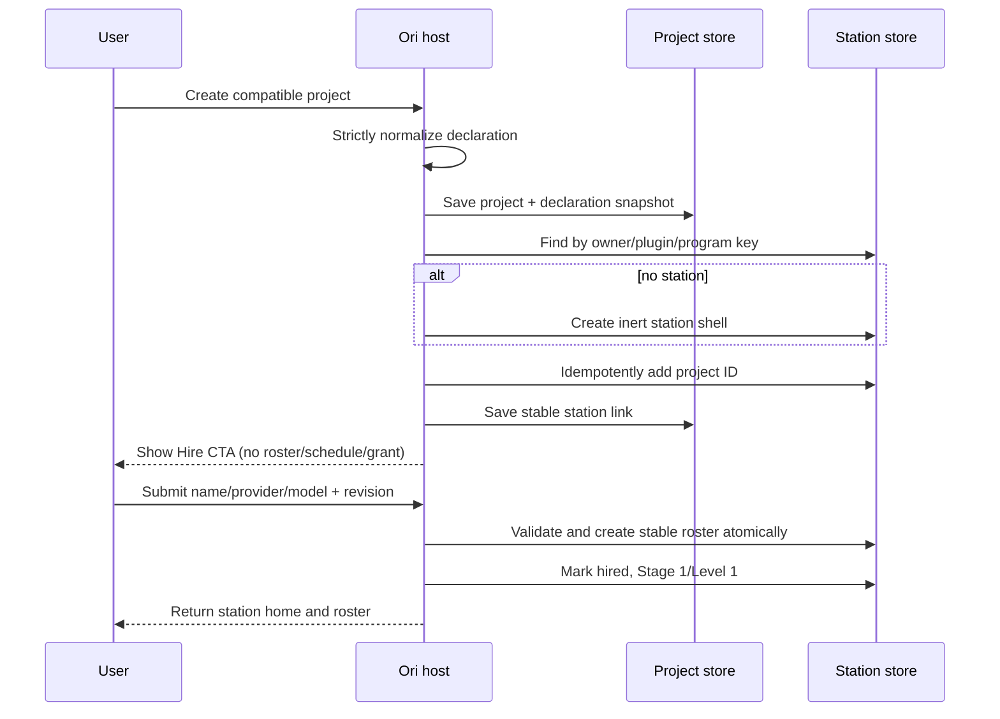
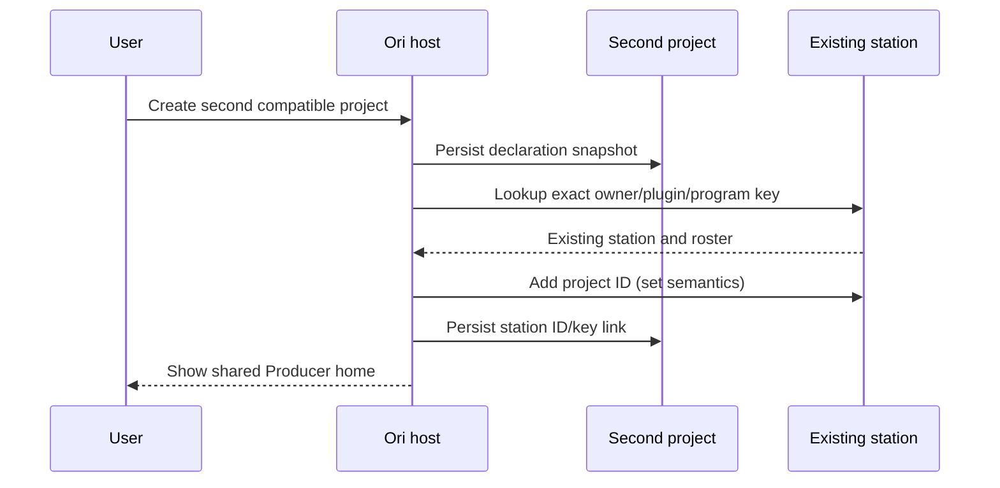
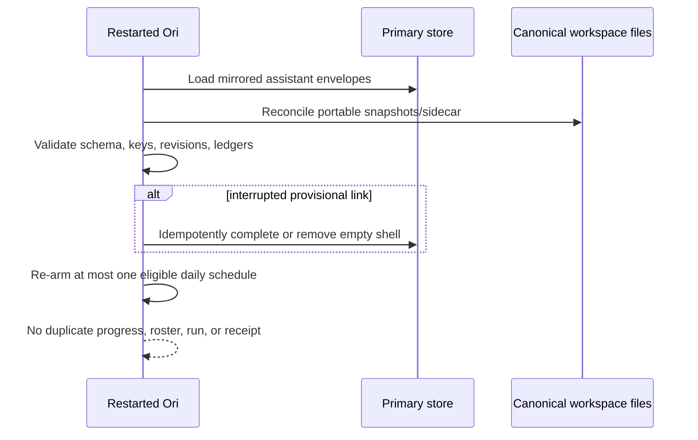
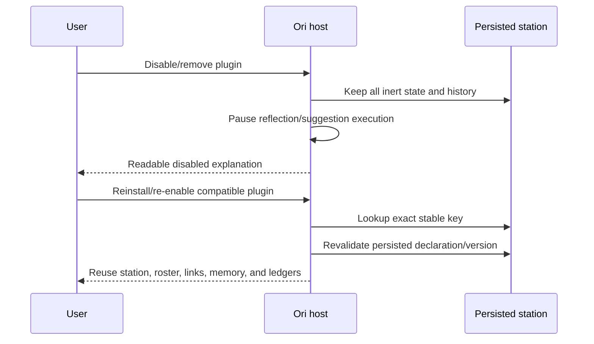

# Assistant Program Contract v1

Status: accepted for implementation

## Purpose and boundaries

Assistant programs are a generic, trusted-blueprint contract for one durable
assistant station shared by a bounded set of project workspaces. The contract
contains inert data only. It cannot declare HTML, URLs, filesystem paths,
commands, code, MCP servers, runtime grants, confirmation policy, or executable
hooks.

A program has two distinct persistence surfaces:

1. Every compatible project snapshots the normalized declaration in its
   `TemplateProvenance` and stores an immutable project link.
2. One dedicated station workspace owns hire state, the stable roster, persona
   progress, reflection state, managed learnings, and idempotency ledgers.

The station key is `(owner_user_id, plugin_id, program_id)`. Display names,
folder slugs, template names, tags, project filenames, and plugin availability
are never identity inputs.

The feature is domain-blind in Ori. Labels, role prompts, stage names, hire copy,
reflection rubric, and recommendation wording come from the trusted declaration.

## Versioned declaration

`template.json` may contain one optional `assistant_program` object. Version 1
is decoded as an isolated raw JSON block with unknown fields rejected. The
whole block is either normalized or unusable; no subset is applied.

The v1 block contains:

- `schema_version`, `id`, station display copy, and default primary-role name;
- exactly one primary role and a bounded list of specialist roles, each with a
  stable ID, label, description, prompt, and trusted skill names;
- ordered persona stages and monotonic accepted-completion thresholds;
- bounded reflection settings: minimum linked projects, daily cadence, maximum
  projects/events/candidates/evidence, and rubric text;
- hire, progress, disabled-state, and promotion display text.

Limits are enforced before workspace creation: 8 roles, 8 stages, 8 KiB per
prompt/rubric, 64 candidates, 16 evidence references per candidate, 32 linked
projects per reflection, 128 events per project, and no schedule more frequent
than daily. Stable IDs are lowercase ASCII identifiers of at most 64 bytes.
Exactly one role is primary; role and stage IDs are unique; the first stage
starts at zero; later stage thresholds increase strictly; every referenced
primary role and stage must exist.

An absent block is a no-op. Unsupported versions, unknown fields, oversized
text/collections, invalid references, and malformed bounds set an actionable
`assistant_program_error` and block creation for trusted plugin blueprints.
Ordinary and older blueprints remain unchanged.

## Durable records

### Declaration snapshot

`TemplateProvenance.AssistantProgram` stores a deep copy of the normalized
contract as it existed at project creation or explicit legacy activation. A
plugin update cannot retroactively alter that snapshot.

### Project link

Each project stores:

- station workspace ID;
- owner/plugin/program key;
- declaration schema version;
- linked-at UTC timestamp; and
- state revision.

The link survives project and station renames. A deleted project is ignored by
station reads and reflection; its stable ID remains in historical evidence. A
deleted station leaves projects in a recoverable `station_unavailable` state;
Ori never guesses a replacement from names.

### Station state

The station stores:

- schema version and state revision;
- owner/plugin/program key and declaration snapshot;
- sorted, deduplicated linked project IDs;
- hire status and hired-at UTC timestamp;
- stable roster role-to-agent-instance IDs and the chosen provider/model;
- persona stage, level, accepted-completion aggregate, and stage-entered UTC
  timestamps;
- one durable promotion receipt;
- reflection schedule/run state;
- bounded completion, reflection, learning, and suggestion idempotency records.

All mutations use one `Store.Update` boundary per owning workspace and compare
`state_revision`. A repeated operation with the same idempotency key returns the
existing result. Cross-workspace creation writes the station first, then the
project link; failure removes a newly-created empty station or removes the
provisional station link, matching the existing workspace-creation rollback
style. Reconciliation is safe to retry after a process crash.

Persona stage is not `types.AgentEvolution.Stage`. Existing evolution XP,
paths, tools, grants, confirmation tiers, and runtime capabilities are not read
or changed by assistant persona progression.

### Managed learning sidecar

The station folder contains `.ori/assistant-program-learnings-v1.json`, a fixed,
host-controlled path written atomically with mode `0600`. It stores candidates,
approved learning revisions, tombstones, and run diagnostics. It never stores
secrets, executable content, absolute paths, or raw plugin configuration.

A learning has stable learning/revision IDs, normalized fingerprint, type,
validated text, confidence, resolvable evidence references, source run,
created/approved/edited/deleted UTC timestamps, and optimistic version.
Only the current approved, non-deleted revision is projected into the Memory API
and model context. Candidates and tombstones are never injected. Evidence is
rendered as quoted inert provenance, not instructions.

`MEMORY.md` remains the byte-preserving source for ordinary human entries and
keeps its index-based CRUD. Managed learning APIs are ID-based. Editing creates
a revision; deleting writes a tombstone and removes prompt projection. A
missing sidecar means no managed records. Malformed or unsupported sidecars
fail safe and remain untouched; Ori reports recovery guidance and never
clobbers `MEMORY.md`. Memory text uses `ValidateMemoryText` and secret checks.

## Reflection and suggestion rules

Reflection is eligible only for a hired station with at least the declaration's
minimum distinct live project links. It is asynchronous, read-only, capped to
one in-flight run and one run per day, and uses linked project IDs only. Inputs
are bounded accepted-task summaries, user decisions, and current approved
learnings. Content is quoted as untrusted data. Evidence must resolve to at
least three distinct linked projects.

Candidates require review. Approval promotes a candidate to managed memory;
rejection and deletion retain fingerprints so equivalent output is suppressed.
Approved learning revisions may produce project-scoped Action Center
opportunities. A deterministic fingerprint spans program, learning revision,
action, and target project. Existing new, snoozed, dismissed, planned, or
resolved records suppress duplicate generation. Accepting uses Action Center's
idempotent Add-to-Backlog path and creates a normal non-running task. Progress
is awarded only after that accepted task (or a manually accepted task) reaches
canonical completion.

## HTTP API

All routes use workspace UUIDs, authorize station/project membership, require
the repository's normal method/CSRF policy, use escaped JSON text, and expose no
absolute paths.

- `GET /api/workspaces/{projectID}/assistant-program` — link, station summary,
  declaration display data, progress, and hire state.
- `POST /api/workspaces/{projectID}/assistant-program/activate` — explicit,
  idempotent legacy activation.
- `POST /api/workspaces/{projectID}/assistant-program/hire` —
  `{name, provider?, model?, version}`; idempotently materializes the roster.
- `GET /api/workspaces/{stationID}/assistant-program/projects` — sorted live
  linked projects.
- `POST /api/workspaces/{stationID}/assistant-program/promotion/ack` — consumes
  one promotion receipt with optimistic version.
- `POST /api/workspaces/{stationID}/assistant-program/reflect` — requests the
  shared bounded reflection path; returns `202` and a run ID.
- `GET /api/workspaces/{stationID}/assistant-program/learnings` — candidates,
  current managed learnings, and safe diagnostics.
- `POST /api/workspaces/{stationID}/assistant-program/candidates/{id}/approve`
- `POST /api/workspaces/{stationID}/assistant-program/candidates/{id}/reject`
- `PATCH /api/workspaces/{stationID}/assistant-program/learnings/{id}`
- `DELETE /api/workspaces/{stationID}/assistant-program/learnings/{id}`

Mutations require the current record version. Stale writes return `409` with
only the current version. Validation returns `400`; missing membership returns
`404` (not `403`) to avoid disclosing unrelated workspaces; unavailable plugin
behavior returns a readable disabled state rather than deleting data.

Text limits match the declaration and memory limits. API collections are
bounded by the persisted limits and stable-sorted. All timestamps are RFC3339
UTC with nanoseconds omitted.

## Lifecycle semantics

- **First compatible project:** create/reuse one station shell and link the
  project. Do not hire, schedule, grant capability access, or run anything.
- **Hire:** after explicit submission, create the declaration roster once and
  initialize Stage 1/Level 1. Provider/model defaults use existing resolution;
  omitted values are not saved as invented defaults.
- **Second project:** resolve the same key, add one sorted unique project ID,
  persist the same station ID in the project, and reuse the roster.
- **Legacy project:** plugin upgrade may expose an Activate action. Activation
  snapshots the current declaration and performs the same idempotent shell/link
  flow. It never silently creates agents, schedules, or authority.
- **Rename:** stable IDs and keys remain unchanged. UI reads current display
  names through IDs.
- **Project deletion:** omit the project from live lists/reflection; preserve
  historical evidence labels as unavailable.
- **Agent deletion:** station reads report the missing role and offer repair;
  they never silently create a replacement or transfer authority.
- **Station deletion:** links report station unavailable and require explicit
  recovery.
- **Plugin disable/removal:** stop reflection and suggestion generation. Keep
  station, project links, memory, tasks, tombstones, and suggestions readable.
- **Reinstall/re-enable:** lookup by stable key reuses state and does not
  duplicate station, roster, schedules, learnings, or suggestions.

## Sequence diagrams

### First project and hire

### Second project reuse

### Restart recovery

### Plugin removal and reinstall

## Compatibility and rollout matrix

| Host / plugin | Behavior |
|---|---|
| Old host / new plugin | Plugin must declare minimum host support. Installation/blueprint loading fails closed; no partial workspace is created. |
| New host / old plugin | No assistant declaration, therefore unchanged one-project/one-agent behavior. |
| New host / new plugin | v1 declaration loads, snapshots, and enables explicit shell/hire flow. |
| Plugin disabled/removed | Persisted data remains readable; generation and plugin-derived execution are paused. |
| Plugin re-enabled | Exact key reuses existing state; no duplicates. |

Host support lands first. The coordinated plugin candidate bumps its blueprint
version and minor plugin version, and declares the minimum compatible Ori host
feature `assistant_program_v1`. Publishing/tagging the plugin remains a separate
human-confirmed release action after the Ori change is available.

## Privacy, permissions, and telemetry

Assistant state never expands authority. Before/after-stage effective toolboxes,
runtime grants, filesystem roots, MCP servers, and confirmation policy must be
equivalent. Reflection does not declare live-control capabilities and never
writes project files. Learning/suggestion events use the existing allowlisted
vocabulary and stable IDs/counts only; free text, evidence contents, paths, and
file contents are excluded.
