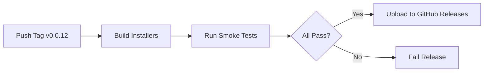

# Smoke Testing Guide

This guide explains how to run smoke tests for Ori Agent installers across all platforms.

> **Note**: For detailed manual installer testing, VM setup, and platform-specific testing strategies, see [TESTING_INSTALLERS.md](TESTING_INSTALLERS.md). This guide focuses on automated smoke testing.

## What Are Smoke Tests?

**Smoke tests** are lightweight tests that verify the basic functionality of installed software:

✅ **What they test:**
- Installer packages can be installed successfully
- Server binary starts without crashing
- Server responds to HTTP requests
- Health check endpoint works
- Core files are in the right places

❌ **What they DON'T test:**
- Full API functionality
- UI interactions
- Plugin system
- Database operations
- Complex workflows

**Think of smoke tests as:** "Can I turn it on and get a response?"

## Running Smoke Tests Locally

### Quick Test (All Platforms via Script)

```bash
# From project root
./scripts/test-all-installers.sh
```

This script:
1. Builds all installers (DMG, .deb, .rpm)
2. Tests installation
3. Starts the server
4. Checks HTTP responses
5. Verifies health endpoint
6. Cleans up

**Time**: ~5-10 minutes
**Requires**: Docker (for Linux tests)

### Manual Smoke Test

#### macOS

```bash
# 1. Build DMG
goreleaser release --snapshot --clean --skip=publish
VERSION=$(cat VERSION)-next
ARCH=$(uname -m)
./build/macos/create-dmg.sh "$VERSION" "$ARCH" dist

# 2. Install
open dist/OriAgent-*-$ARCH.dmg
# Drag to Applications

# 3. Test
/Applications/OriAgent.app/Contents/Resources/ori-agent --port=18765 &
SERVER_PID=$!

# 4. Verify
curl http://localhost:18765/api/health

# 5. Cleanup
kill $SERVER_PID
```

#### Linux (.deb)

```bash
# 1. Build package
goreleaser release --snapshot --clean --skip=publish

# 2. Install
sudo dpkg -i dist/ori-agent_*_linux_amd64.deb

# 3. Test
/usr/bin/ori-agent --port=18765 &
SERVER_PID=$!

# 4. Verify
curl http://localhost:18765/api/health

# 5. Cleanup
kill $SERVER_PID
sudo apt-get remove ori-agent -y
```

#### Windows (MSI)

```powershell
# 1. Build MSI
goreleaser release --snapshot --clean --skip=publish
$VERSION = (Get-Content VERSION).Trim() + "-next"
.\build\windows\create-msi.ps1 -Version $VERSION -Arch "amd64"

# 2. Install
msiexec /i dist\ori-agent-$VERSION-amd64.msi /qn

# 3. Test
& "C:\Program Files\OriAgent\bin\ori-agent.exe" --port=18765

# 4. Verify (in another PowerShell)
Invoke-WebRequest -Uri "http://localhost:18765/api/health"

# 5. Cleanup
msiexec /x {PRODUCT-CODE} /qn
```

## Running Smoke Tests in CI/CD

### GitHub Actions Workflow

The smoke tests automatically run in GitHub Actions on:
- Every push to `main` or `develop`
- Every pull request to `main`
- Manual trigger

**Workflow file**: `.github/workflows/smoke-tests.yml`

### Platforms Tested

| Platform | Runner | Test Type |
|----------|--------|-----------|
| macOS (Intel + Apple Silicon) | `macos-latest` | DMG install + server start |
| Linux (Ubuntu .deb) | `ubuntu-latest` | .deb install + server start |
| Linux (Fedora .rpm) | `fedora:38` container | .rpm install + server start |
| Windows | `windows-latest` | MSI install + server start |

### Manual Trigger

```bash
# Trigger from GitHub UI:
# Actions → Cross-Platform Smoke Tests → Run workflow

# Or via gh CLI:
gh workflow run smoke-tests.yml
```

### View Results

```bash
# List recent runs
gh run list --workflow=smoke-tests.yml

# View specific run
gh run view <run-id>

# View logs
gh run view <run-id> --log
```

## What Gets Tested (Per Platform)

### macOS DMG

```
✓ DMG file builds
✓ DMG mounts successfully
✓ .app bundle structure correct
✓ Server binary exists in Resources/
✓ Server starts on custom port
✓ HTTP server responds within 15 seconds
✓ /api/health endpoint returns "ok"
✓ Server can be stopped gracefully
```

### Linux .deb (Debian/Ubuntu)

```
✓ .deb package builds
✓ Package installs via dpkg
✓ Binary installed at /usr/bin/ori-agent
✓ systemd service file installed
✓ Config directory created
✓ Desktop entry installed
✓ Server starts on custom port
✓ HTTP server responds within 15 seconds
✓ /api/health endpoint returns "ok"
```

### Linux .rpm (Red Hat/Fedora)

```
✓ .rpm package builds
✓ Package installs via dnf
✓ Binary installed at /usr/bin/ori-agent
✓ systemd service file installed
✓ Config directory created
✓ Server starts on custom port
✓ HTTP server responds within 15 seconds
✓ /api/health endpoint returns "ok"
```

### Windows MSI

```
✓ MSI package builds
✓ MSI installs silently
✓ Binary installed at C:\Program Files\OriAgent\bin\
✓ Start Menu shortcuts created
✓ Server starts on custom port
✓ HTTP server responds within 15 seconds
✓ /api/health endpoint returns "ok"
```

## Smoke Test Output

### Successful Test

```
🧪 Running smoke test...
  → Starting server (PID: 12345)...
  ✓ Server responded to HTTP
  ✓ Health check passed
  → Server stopped
✅ macOS DMG: PASSED (with smoke test)
```

### Failed Test (Server doesn't start)

```
🧪 Running smoke test...
  → Starting server (PID: 12345)...
  ❌ Server failed to start within 15 seconds

  Server logs:
  Error: port 18765 already in use
```

### Failed Test (Health check fails)

```
🧪 Running smoke test...
  → Starting server (PID: 12345)...
  ✓ Server responded to HTTP
  ⚠️  Health check failed (server may need API key)
  → Server stopped
✅ macOS DMG: PASSED (with smoke test)
```

**Note**: The test still passes if health check fails because the server might need configuration (API keys, etc.). The important part is that the server starts and responds.

## Troubleshooting

### Port Already in Use

**Error**: `Error: port 18765 already in use`

**Solution**:
```bash
# Find process using port
lsof -i :18765

# Kill it
kill <PID>

# Or use different port
./ori-agent --port=19000
```

### Server Starts But Doesn't Respond

**Possible causes:**
1. Server crashed after starting (check logs)
2. Firewall blocking connections
3. Server listening on wrong interface (0.0.0.0 vs 127.0.0.1)

**Debug**:
```bash
# Check server logs
tail -f /tmp/ori-agent-test.log

# Check if port is actually listening
lsof -i :18765
netstat -an | grep 18765
```

### Docker Tests Fail (Linux)

**Error**: `docker: command not found`

**Solution**:
```bash
# Install Docker Desktop
brew install --cask docker

# Start Docker Desktop
open -a Docker

# Retry test
./scripts/test-all-installers.sh
```

### GitHub Actions Timeout

**Error**: Job exceeded timeout of 20 minutes

**Possible causes:**
1. Server never started (infinite wait loop)
2. GoReleaser build taking too long
3. Network issues downloading dependencies

**Solution**: Check workflow logs for the specific step that timed out.

## Integration with Release Process

### Automated Release Workflow



### Release Checklist

Before tagging a release:

```bash
# 1. Run local smoke tests
./scripts/test-all-installers.sh

# 2. Push to develop branch
git push origin develop

# 3. Wait for CI smoke tests to pass
gh run list --workflow=smoke-tests.yml

# 4. If all pass, tag release
git tag v0.0.12
git push origin v0.0.12
```

## Advanced: Adding More Smoke Tests

### Current Tests

```bash
# scripts/test-all-installers.sh
curl http://localhost:18765/api/health
```

### Add Plugin Test

```bash
# Test that plugins directory exists
test -d /etc/ori-agent/plugins && echo "✓ Plugins directory"

# Test that a default plugin loads
curl http://localhost:18765/api/plugins | grep -q "math"
```

### Add Agent Test

```bash
# Test agent creation API
curl -X POST http://localhost:18765/api/agents \
  -H "Content-Type: application/json" \
  -d '{"name":"test-agent","description":"Test"}'
```

### Add Memory Test

```bash
# Test that server doesn't use excessive memory
ps aux | awk '/ori-agent/ {if($6 > 500000) exit 1}' # <500MB
```

## Next Steps

After smoke tests pass, you may want:

1. **Integration Tests** - Test full API functionality
2. **E2E Tests** - Test UI workflows with browser automation
3. **Performance Tests** - Load testing, stress testing
4. **Security Tests** - Vulnerability scanning, penetration testing

See: `docs/TESTING_STRATEGY.md` (coming soon)

---

**Last Updated**: November 18, 2025
**Automation Status**: ✅ Fully automated in CI/CD
